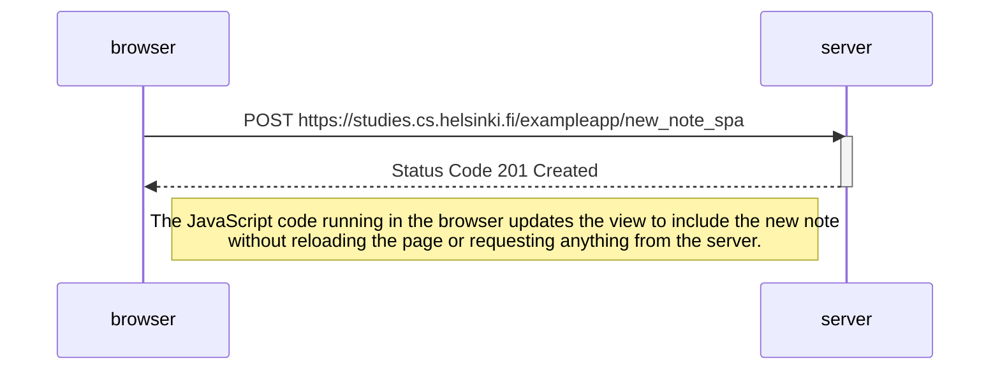

```mermaid
sequenceDiagram
    participant browser
    participant server

    browser->>server: POST https://studies.cs.helsinki.fi/exampleapp/new_note_spa
    activate server
    server-->>browser: Status Code 201 Created
    deactivate server

    Note right of browser: The JavaScript code running in the browser updates the view to include the new note <br>without reloading the page or requesting anything from the server.
```